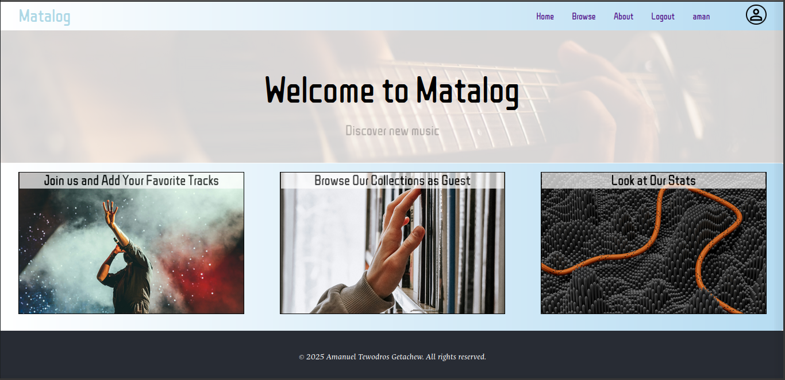
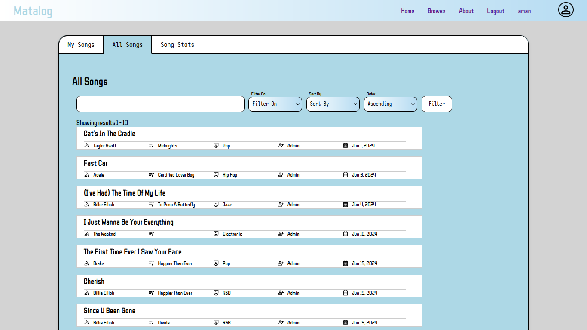
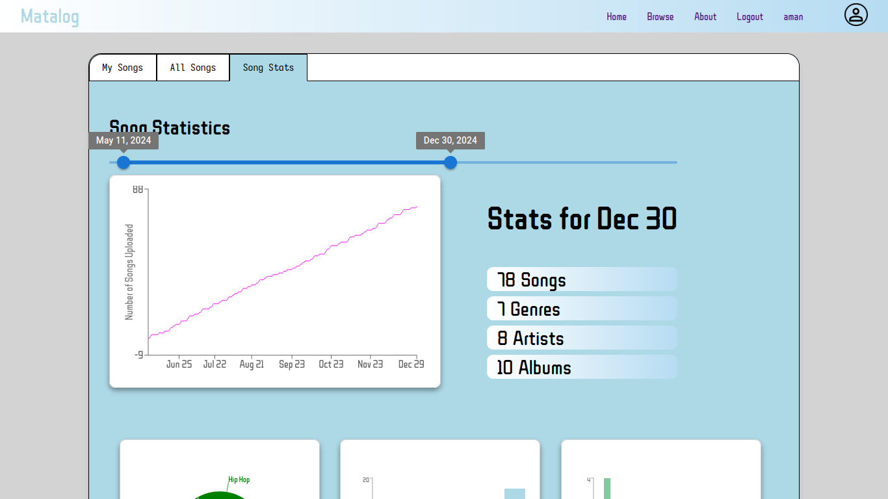
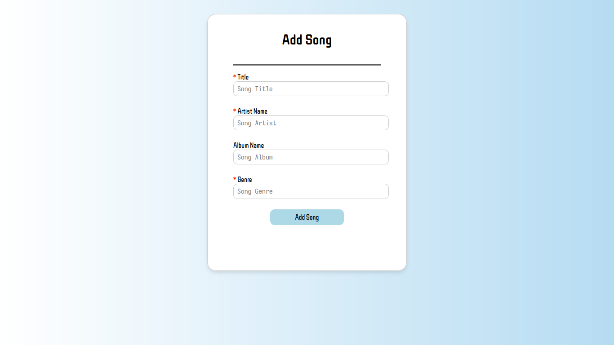

# Matalog Songs Registry
This repository contains a simple CRUD full-stack app for managing song data using MERN stack. Here is a list of features included:

1. CRUD operations on songs 
2. Authentication and Authorization
3. Frontend and API pagination
4. Song Data Statistics
5. Data Aggregation with MongoDB 

## Screenshot

Below is a screenshot of the app in action:






### 1. Install dependencies:

Go to the `server` folder, and run `install`.

```
cd ./server
npm i
```

Go to the `client` folder, and run `install`.

```
cd ./client
npm i
```

### 2. Prepare MongoDB:

Prepare your MongoDB database (using [Atlas](https://www.mongodb.com/cloud/atlas),
or [Community](<https://github.com/benelferink/mern-template/wiki/Install-MongoDB-Community-Server-(MacOS)>)). Then configure your database within `server/src/constants/index.js` (or `server/src/.env`), by configuring the `MONGO_URI` variable.

### 3. Start applications:

Go to the `server` folder, and run `dev`.

```
cd ./server
npm run dev
```

Go to the `client` folder, and run `dev`.

```
cd ./client
npm run dev
```


